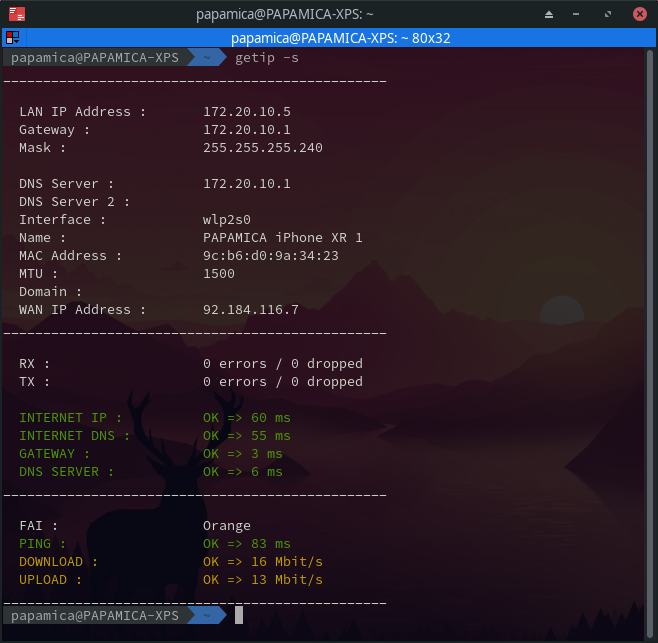
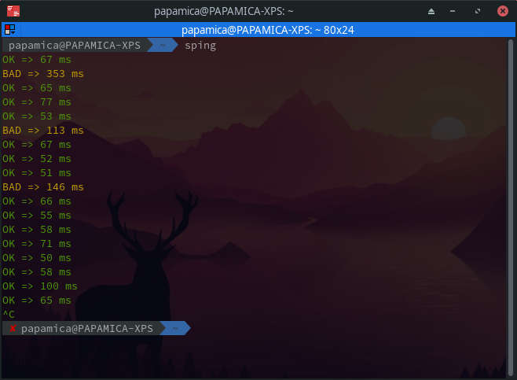

# Getip
Simples scripts to improve the recovery of network informations.

## Installation

### Getip and sping :
Use the script "install-all.sh" to install getip and sping.

This script copy getip.sh, getip-plugin and sping.sh to user directory and he add alias to bash and zsh.


```bash
chmod +x install-all.sh
./install-all.sh
```

### Getip Plugin for XFCE :
Use the plugin "genmon", add this "/home/*users*/.getip-plugin.sh (repace *user* with your username).

Set "*Periode*" to "*1.00*".

## Usage

### Getip


Options availables :
Option | Description
------------ | -------------
  -s | Launch a speedtest (require speedtest-cli)
  -i |     Allows the choice of the interface to display
  -r |     Change the default route by the chosen interface" (For speedtest and pings tests)
  -h |     Diplay this help

Exemples :
Command | Expected result
------------ | -------------
getip       |IP informations
getip -s    |IP informations + Speedtest
getip -i    |IP informations + Choice interface
getip -ir   |IP informations + Choice interface + Change route
getip -sir  |IP informations + Choice interface + Change route + Speedtest


### sping


Use "*sping*" with IP and delay between two ping.

Exemples :
Command | Expected result
------------ | -------------
sping       |Ping to 8.8.8.8 every 1 second
sping 10.10.0.1    |Ping 10.10.0.1 every 1 second
sping 10.10.0.1 8    |Ping 10.10.0.1 every 8 seconds

### Getip Plugin


## Contributing
Pull requests are welcome. For major changes, please open an issue first to discuss what you would like to change.

Please make sure to update tests as appropriate.

## License
[MIT](https://choosealicense.com/licenses/mit/)
